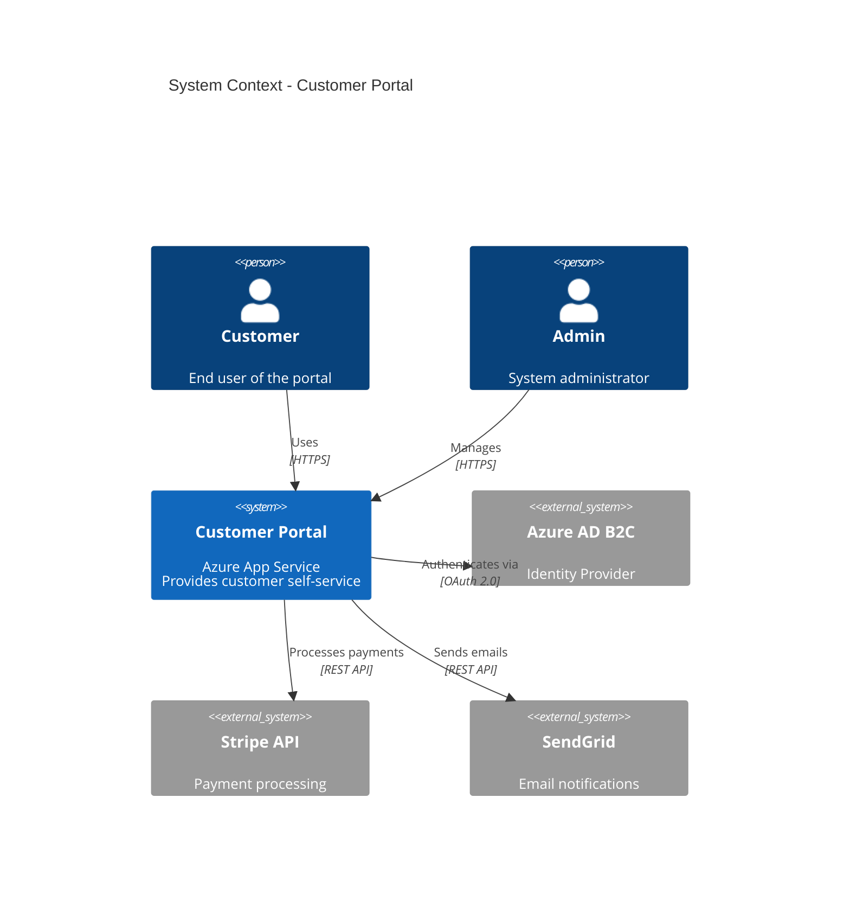
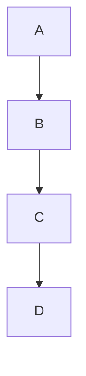

# Architect - Validation & Quality Rules

Diese Instructions werden **automatisch** angewendet beim Arbeiten mit Architecture-Dokumenten und Task-Dateien. Sie ergänzen den Architect Chatmode mit spezifischen Validierungs- und Quality-Checks.

> **Wichtig:** Diese Regeln gelten zusätzlich zu `.github/chatmodes/architect.chatmode.md`

## 📁 Unterstützte Dateitypen

Diese Validierungsregeln greifen bei:

```
✅ architecture/decisions/ADR-*.md
✅ architecture/diagrams/**/*.md (mit Mermaid)
✅ requirements/tasks/TASK-*-*.md
✅ requirements/tasks/TASK-INDEX.md
✅ ARC42-DOCUMENTATION.md
✅ BACKLOG.md (Code Mapping Section)
```

---

## 🔍 Automatische Validierungen

### 1. Task-Dateinamen-Konventionen

**Pattern-Validierung für Task-Files:**

```javascript
// Automatischer Check beim Erstellen
const taskPattern = /^TASK-\d{3}-\d{3}-[a-z0-9-]+\.md$/;

// Beispiele:
// TASK-001-001: Feature 001, Task 001
// TASK-003-012: Feature 003, Task 012
```

**Beispiele:**

```markdown
✅ TASK-001-001-setup-database-schema.md
✅ TASK-003-012-implement-oauth-flow.md
✅ TASK-042-005-create-user-api-endpoint.md

❌ task-1-1.md                           (lowercase, keine 3-digit)
❌ TASK-01-01-setup.md                   (nicht 3-stellig)
❌ TASK-001-001-Setup Database.md        (spaces, CamelCase)
❌ TASK_001_001_setup.md                 (underscores statt dashes)
```

**Struktur:**
```
TASK-{FEATURE-ID}-{TASK-NUMBER}-{slug}.md
     └─ 001-999   └─ 001-999     └─ lowercase-with-dashes
```

**Fehlermeldung bei Verstoß:**

```
❌ Task-Dateiname ungültig

Datei: task-setup-db.md
Problem: Entspricht nicht TASK-XXX-YYY-slug.md Pattern

Korrekt wäre: TASK-001-001-setup-database-schema.md

Format-Regeln:
  • TASK-XXX-YYY-descriptive-slug.md
  • XXX: Feature-ID (001-999, aus FEATURE-XXX)
  • YYY: Task-Nummer innerhalb Feature (001-999)
  • slug: lowercase, nur a-z, 0-9, Bindestriche

Beispiele:
  TASK-001-001-setup-azure-sql.md
  TASK-003-005-implement-jwt-auth.md
```

---

### 2. Task-Dependencies-Validierung

**Automatische Dependency-Chain-Checks:**

```markdown
CHECK beim Speichern einer Task-Datei:

1. ✅ Predecessor existiert und ist abgeschlossen?
   (Wenn Predecessor vorhanden)

2. ✅ Successor existiert und referenziert diesen Task zurück?
   (Wenn Successor definiert)

3. ✅ "Blocks" Tasks existieren?
   (Alle aufgelisteten Tasks müssen existieren)

4. ✅ "Blocked By" Tasks sind korrekt?
   (Tasks in "Blocked By" sollten diesen Task in "Blocks" haben)

5. ✅ Zirkuläre Dependencies vermieden?
   (A → B → C → A ist verboten)

6. ✅ Orphan Tasks identifiziert?
   (Tasks ohne Predecessor/Successor sollten First/Last sein)
```

**Dependency-Struktur in Task-Datei:**

```markdown
## 🔗 Dependencies

**Predecessor:** [TASK-001-002](./TASK-001-002-create-user-model.md)  
**Successor:** [TASK-001-004](./TASK-001-004-implement-email-service.md)

**Blocks:**
- [TASK-002-001](./TASK-002-001-user-profile-page.md) - Needs auth
- [TASK-003-001](./TASK-003-001-admin-dashboard.md) - Needs auth

**Blocked By:**
- [TASK-001-001](./TASK-001-001-azure-ad-b2c-setup.md) - Azure setup required
- [TASK-001-002](./TASK-001-002-create-user-model.md) - User model needed

**Related:**
- [IMPROVEMENT-001](../../improvements/IMPROVEMENT-001-add-2fa.md)
- [BUGFIX-001](../../bugfixes/BUGFIX-001-fix-token-refresh.md)
```

**Fehlermeldungen:**

```
❌ Dependency-Validierung fehlgeschlagen

Datei: TASK-001-003-create-auth-endpoint.md

Probleme gefunden: 3

1. ❌ Predecessor nicht abgeschlossen
   Predecessor: TASK-001-002-create-user-model.md
   Status: 🚧 In Progress (erwartet: ✅ Done)
   
   → Task kann nicht gestartet werden bis Predecessor ✅ Done

2. ❌ "Blocked By" Asymmetrie
   Dieser Task hat: Blocked By TASK-001-001
   ABER: TASK-001-001 hat NICHT "Blocks: TASK-001-003"
   
   → Füge in TASK-001-001.md hinzu:
      Blocks: TASK-001-003

3. ❌ Successor-Task existiert nicht
   Successor: TASK-001-004-implement-email-service.md
   Problem: Datei nicht gefunden
   
   → Erstelle TASK-001-004 ODER entferne Successor
```

**Zirkuläre Dependency Erkennung:**

```javascript
function detectCircularDependencies(taskId) {
  const visited = new Set();
  const recursionStack = new Set();
  
  function dfs(currentTask) {
    visited.add(currentTask);
    recursionStack.add(currentTask);
    
    const successors = getSuccessors(currentTask);
    for (const successor of successors) {
      if (!visited.has(successor)) {
        if (dfs(successor)) return true;
      } else if (recursionStack.has(successor)) {
        return true; // Cycle detected!
      }
    }
    
    recursionStack.delete(currentTask);
    return false;
  }
  
  return dfs(taskId);
}
```

```
❌ KRITISCH: Zirkuläre Dependency erkannt!

Cycle gefunden:
  TASK-001-003 → TASK-001-004 → TASK-001-005 → TASK-001-003
                                                      ↑________|

Dies führt zu einer Deadlock-Situation!

Aktion erforderlich:
  Analysiere die Task-Reihenfolge und breche den Cycle:
  
  Option 1: Entferne Dependency TASK-001-005 → TASK-001-003
  Option 2: Refactor Tasks um logische Reihenfolge
  Option 3: Splitte Tasks in kleinere, unabhängige Units
```

---

### 3. Task-Spezifikations-Qualität

**Atomic Task Check (≤4h Regel):**

```markdown
CHECK jede Task-Datei:

✅ Estimated Time ≤ 4 Stunden?
✅ Task-Beschreibung klar und spezifisch?
✅ Implementation Details vollständig?
✅ Test Strategy definiert?
✅ Acceptance Criteria messbar?
✅ Keine Platzhalter in Task-Details?

VERBOTEN:
❌ Tasks >4h (müssen gesplittet werden)
❌ Vage Beschreibungen ("Fix the thing")
❌ TODO, TBD in Implementation Details
❌ "See Issue for details" (Task muss selbsterklärend sein)
```

**Fehlermeldung bei zu großem Task:**

```
❌ Task nicht atomic (>4h Regel verletzt)

Datei: TASK-001-003-implement-authentication.md
Estimated Time: 8 hours

Problem: Task ist zu groß für atomare Ausführung
Maximum: 4 Stunden pro Task

Empfohlener Split:
  TASK-001-003-implement-jwt-generation.md (2h)
  TASK-001-004-implement-token-validation.md (2h)
  TASK-001-005-implement-refresh-flow.md (2h)
  TASK-001-006-add-auth-middleware.md (2h)

Aktion erforderlich:
  1. Splitte Task in kleinere Units (je ≤4h)
  2. Erstelle separate Task-Dateien
  3. Definiere Dependencies zwischen neuen Tasks
  4. Update TASK-INDEX.md
```

**Implementation Details Quality Check:**

```markdown
✅ GUTE Implementation Details:

## 📋 Implementation Details

### 1. Azure AD B2C Configuration
- Create new Azure AD B2C tenant: "myapp-b2c.onmicrosoft.com"
- Register app with redirect URI: https://myapp.com/auth/callback
- Configure user flows: Sign-up/Sign-in combined
- Enable MFA: Optional for users

### 2. Backend Code Changes
**File:** `src/auth/oauth.py`
```python
# Add Azure AD B2C provider
AZURE_B2C_CONFIG = {
    'tenant': 'myapp-b2c.onmicrosoft.com',
    'client_id': os.getenv('AZURE_B2C_CLIENT_ID'),
    'authority': 'https://myapp-b2c.b2clogin.com/tfp/...'
}
```

### 3. Environment Variables
```bash
AZURE_B2C_CLIENT_ID=<from-azure-portal>
AZURE_B2C_CLIENT_SECRET=<from-azure-portal>
AZURE_B2C_TENANT=myapp-b2c.onmicrosoft.com
```

### 4. Test Data
- Test user: testuser@example.com
- Valid token: JWT with 1h expiry
- Invalid token: Expired JWT for negative tests
```

**VS:**

```markdown
❌ SCHLECHTE Implementation Details:

## Implementation Details

Setup Azure B2C and implement OAuth flow. See ISSUE-042 for requirements.

TODO: Add code examples
TBD: Configuration details
```

**Fehlermeldung bei schlechter Spezifikation:**

```
⚠️ Task-Spezifikation unvollständig

Datei: TASK-001-003-setup-oauth.md

Gefundene Probleme: 4

1. ❌ Implementation Details zu vage
   Gefunden: "Setup Azure B2C"
   Benötigt: Konkrete Steps mit Konfigurationswerten
   
2. ❌ Platzhalter in Spezifikation
   Gefunden: "TODO: Add code examples"
   Benötigt: Vollständige Code-Snippets
   
3. ❌ Keine Test Strategy
   Section "Test Strategy" fehlt komplett
   
4. ❌ Files Section leer
   Benötigt: Liste aller zu ändernden/erstellenden Dateien

Aktion erforderlich:
  1. Konkretisiere Implementation Details mit:
     - Genaue Config-Werte
     - Code-Beispiele für alle Steps
     - Environment-Variablen
  2. Entferne alle Platzhalter
  3. Füge Test Strategy hinzu
  4. Liste alle betroffenen Files

Template: requirements/tasks/TASK-TEMPLATE.md
```

---

### 4. TASK-INDEX.md Konsistenz

**Automatische Index-Validierung:**

```markdown
CHECK TASK-INDEX.md:

1. ✅ Alle Task-Dateien im Index vorhanden?
2. ✅ Alle Index-Einträge haben zugehörige Dateien?
3. ✅ Task-Chain lückenlos (001 → 002 → 003...)?
4. ✅ Status-Konsistenz mit Task-Dateien?
5. ✅ Estimated Time Summen korrekt?
6. ✅ Critical Path markiert?
```

**Beispiel TASK-INDEX.md:**

```markdown
# Task Index - Complete Overview

> **Total Tasks:** 42 | **Estimated Time:** 156h | **Critical Path:** 18 Tasks

## Quick Stats
- 📋 Not Started: 28 tasks (98h)
- 🚧 In Progress: 8 tasks (32h)
- ✅ Done: 6 tasks (26h)

## Critical Path (Must finish for MVP)
→ TASK-001-001 → TASK-001-002 → TASK-001-003 → TASK-002-001 → ...

## By Feature

### FEATURE-001: User Authentication (8 tasks, 28h)

| Task | Title | Status | Time | Dependencies |
|------|-------|--------|------|--------------|
| TASK-001-001 | Azure AD B2C Setup | ✅ Done | 4h | None |
| TASK-001-002 | Create User Model | ✅ Done | 3h | TASK-001-001 |
| TASK-001-003 | Auth Endpoint | 🚧 In Progress | 3h | TASK-001-002 |
| TASK-001-004 | Email Service | 📋 Not Started | 4h | TASK-001-003 |
...
```

**Fehlermeldung bei Index-Inkonsistenz:**

```
❌ TASK-INDEX.md Inkonsistenz erkannt

Probleme gefunden: 3

1. ❌ Fehlender Task im Index
   Task-Datei existiert: TASK-001-007-add-logging.md
   ABER: Nicht in TASK-INDEX.md aufgelistet
   
   → Füge in TASK-INDEX.md unter FEATURE-001 hinzu

2. ❌ Status-Mismatch
   TASK-001-003: 
     - In Datei: Status: ✅ Done
     - Im Index: Status: 🚧 In Progress
   
   → Update Index-Status auf ✅ Done

3. ❌ Estimated Time Summe falsch
   FEATURE-001: 
     - Deklariert: 28h
     - Berechnet: 32h (8 Tasks)
   
   → Korrigiere Summe auf 32h ODER prüfe einzelne Task-Zeiten
```

---

### 5. arc42-Dokumentation Validierung

**arc42 Template Compliance:**

```markdown
REQUIRED Sections (12/12):

✅ 1. Einführung und Ziele
✅ 2. Randbedingungen
✅ 3. Kontextabgrenzung
✅ 4. Lösungsstrategie
✅ 5. Bausteinsicht
✅ 6. Laufzeitsicht
✅ 7. Verteilungssicht
✅ 8. Querschnittliche Konzepte
✅ 9. Architekturentscheidungen
✅ 10. Qualitätsanforderungen
✅ 11. Risiken und technische Schulden
✅ 12. Glossar

Jede Section MUSS:
  • Existieren (## Section vorhanden)
  • Content haben (>100 Zeichen)
  • Keine Platzhalter (TODO, TBD)
  • Relevante Diagramme (wo angebracht)
```

**Section-Specific Checks:**

```markdown
### Section 1: Einführung und Ziele
✅ Qualitätsziele dokumentiert?
✅ Stakeholder identifiziert?

### Section 3: Kontextabgrenzung
✅ Context Diagram (C4 Level 1) vorhanden?
✅ Externe Schnittstellen dokumentiert?
✅ @azure Ressourcen identifiziert?

### Section 4: Lösungsstrategie
✅ Technology Stack mit Versionen?
✅ Architecture Patterns benannt?
✅ Deployment Strategy erklärt?

### Section 5: Bausteinsicht
✅ Container Diagram (C4 Level 2) vorhanden?
✅ Komponenten-Zerlegung?
✅ Verantwortlichkeiten klar?

### Section 6: Laufzeitsicht
✅ Min. 2 Sequence Diagrams?
✅ Kritische Use Cases dokumentiert?

### Section 7: Verteilungssicht
✅ Deployment Diagram vorhanden?
✅ Azure Ressourcen mapped?
✅ Skalierungs-Strategie dokumentiert?

### Section 9: Architekturentscheidungen
✅ ADRs verlinkt?
✅ Wichtigste Entscheidungen erklärt?

### Section 10: Qualitätsanforderungen
✅ Qualitätsbaum vorhanden?
✅ Messbare Qualitätsszenarien?
✅ NFRs (Non-Functional Requirements) quantifiziert?
```

**Fehlermeldung bei unvollständiger arc42-Doku:**

```
❌ arc42-Dokumentation unvollständig

Datei: ARC42-DOCUMENTATION.md
Status: 9/12 Sections vorhanden

Fehlende Sections:
  ❌ 6. Laufzeitsicht
  ❌ 10. Qualitätsanforderungen
  ❌ 11. Risiken und technische Schulden

Kritische Probleme in bestehenden Sections:

Section 3 (Kontextabgrenzung):
  ⚠️ Kein Context Diagram gefunden
  ⚠️ Azure Ressourcen nicht dokumentiert
  → Füge C4 Level 1 Diagram hinzu
  → Nutze @azure zur Validierung der Azure-Infrastruktur

Section 5 (Bausteinsicht):
  ⚠️ Nur 87 Zeichen Content (Minimum: 100)
  → Erweitere Komponenten-Beschreibung

Section 7 (Verteilungssicht):
  ⚠️ Keine Mermaid Deployment Diagrams
  → Füge Deployment-Visualisierung hinzu

Aktion erforderlich:
  1. Vervollständige fehlende Sections
  2. Füge Diagramme hinzu (min. 1 pro Section)
  3. Erweitere dünne Sections
  4. Nutze @azure für Azure-spezifische Validierung

Template: architecture/ARC42-TEMPLATE.md
```

---

### 6. ADR (Architecture Decision Records) Validierung

**ADR-Template-Compliance:**

```markdown
REQUIRED Sections für ADR (7/7):

✅ Title (# ADR-XXX: Decision Title)
✅ Status (Proposed|Accepted|Deprecated|Superseded)
✅ Context
✅ Decision
✅ Consequences
✅ Alternatives Considered
✅ Related Decisions

Zusätzliche Checks:
  ✅ ADR-Nummer 3-stellig (001-999)
  ✅ Status ist valide (enum)
  ✅ Consequences hat Pro/Con
  ✅ Min. 2 Alternatives dokumentiert
```

**Status-Validierung:**

```javascript
const validStatuses = [
  'Proposed',      // Zur Diskussion gestellt
  'Accepted',      // Entscheidung getroffen
  'Deprecated',    // Nicht mehr gültig
  'Superseded'     // Ersetzt durch ADR-XXX
];

function validateADRStatus(status) {
  if (!validStatuses.includes(status)) {
    throw new ValidationError(
      `Invalid ADR Status: "${status}"\n` +
      `Valid options: ${validStatuses.join(', ')}`
    );
  }
}
```

**Fehlermeldung bei unvollständigem ADR:**

```
❌ ADR-Validierung fehlgeschlagen

Datei: architecture/decisions/ADR-003-database-choice.md

Probleme gefunden: 3

1. ❌ Fehlende Section: Consequences
   ADR muss Pro/Con der Entscheidung dokumentieren
   
2. ❌ Status ungültig
   Gefunden: "approved"
   Erlaubt: Proposed, Accepted, Deprecated, Superseded
   
3. ❌ Alternatives Considered zu kurz
   Gefunden: 1 Alternative
   Minimum: 2 Alternativen mit Begründung warum abgelehnt

Aktion erforderlich:
  1. Füge ## Consequences Section hinzu:
     ### Positive Consequences
     - [Liste positive Auswirkungen]
     
     ### Negative Consequences
     - [Liste negative Auswirkungen / Trade-offs]
  
  2. Ändere Status zu: "Accepted"
  
  3. Erweitere Alternatives:
     - Alternative B: [Was? Warum abgelehnt?]

Template: architecture/decisions/ADR-TEMPLATE.md
```

---

### 7. Mermaid-Diagramm-Qualität

**Automatische Diagram-Checks:**

```markdown
CHECK für jedes Mermaid-Diagramm:

✅ Syntax valide (mermaid parse erfolgreich)?
✅ Typ angemessen (C4Context für Context, sequence für Flows)?
✅ Beschriftungen vorhanden (keine leeren Nodes)?
✅ Lesbarkeit (nicht zu komplex, <20 Nodes)?
✅ Einheitlicher Stil (konsistente Farben/Shapes)?

Empfohlene Diagram-Types:
  • Context: C4Context (Level 1)
  • Container: C4Container (Level 2)
  • Component: C4Component (Level 3)
  • Sequence: sequenceDiagram
  • Deployment: graph TD
  • State: stateDiagram-v2
```

**Beispiel - GUTES Diagramm:**



**Beispiel - SCHLECHTES Diagramm:**



**Fehlermeldung bei schlechten Diagrammen:**

```
⚠️ Diagramm-Qualität verbesserungsbedürftig

Datei: ARC42-DOCUMENTATION.md
Section: 3. Kontextabgrenzung

Gefundenes Diagramm:
  Type: graph TD
  Nodes: 4
  Beschriftungen: Keine

Probleme:
  1. ⚠️ Keine aussagekräftigen Labels
     Nodes: A, B, C, D (zu generisch)
     → Nutze beschreibende Namen: "Customer Portal", "Azure AD"
  
  2. ⚠️ Falscher Diagramm-Typ für Context
     graph TD ist zu generisch
     → Nutze C4Context für System Context
  
  3. ⚠️ Keine Technologie-Infos
     → Füge Technologie-Stack hinzu: "Azure App Service", "PostgreSQL"

Empfohlene Verbesserung:
  • Wechsle zu C4Context Diagram
  • Füge Person() und System() Nodes mit Beschreibungen hinzu
  • Dokumentiere Beziehungen mit Rel()
  • Nenne verwendete Protokolle (HTTPS, OAuth)

Beispiel: Siehe architecture/diagrams/examples/context-diagram.md
```

---

### 8. Technology Stack Validation

**Version-Check für deklarierte Technologien:**

```markdown
CHECK Technology Stack:

✅ Jede Technologie hat Version?
✅ Versionen sind aktuell/supported?
✅ Breaking Changes dokumentiert (Major Version Upgrades)?
✅ Azure Services mit Pricing Tier dokumentiert?

Beispiel RICHTIG:
  • FastAPI 0.104.1
  • PostgreSQL 15.4
  • Azure App Service (Standard S1)
  • Azure SQL Database (General Purpose - Gen5, 2 vCore)
  • Redis 7.2 (Azure Cache for Redis, Basic C1)

Beispiel FALSCH:
  • FastAPI (keine Version)
  • PostgreSQL (keine Version)
  • Azure SQL (kein Tier)
```

**@azure Integration für Azure-Ressourcen:**

```markdown
WENN Azure Services verwendet:

1. ✅ Nutze @azure zur Validierung:
   "Is Azure App Service Standard S1 appropriate for 
    expected load of 10,000 requests/day?"

2. ✅ Dokumentiere Azure-spezifische Constraints:
   - Region: West Europe (for GDPR)
   - Pricing Tier: Standard S1 (auto-scale)
   - Backup: Geo-redundant (LRS)

3. ✅ Berücksichtige Azure Best Practices:
   @azure "What are best practices for securing 
   Azure App Service with custom domain?"

4. ✅ Validiere Kosten-Schätzung:
   @azure "Estimate monthly cost for: 
   - App Service Standard S1
   - Azure SQL Gen5 2vCore
   - Azure Cache Basic C1"
```

**Fehlermeldung bei fehlenden Versionen:**

```
⚠️ Technology Stack unvollständig

Datei: ARC42-DOCUMENTATION.md
Section: 4. Lösungsstrategie

Probleme gefunden: 5

1. ❌ Backend: "FastAPI" (keine Version)
   → Füge Version hinzu: "FastAPI 0.104.1"
   
2. ❌ Database: "PostgreSQL" (keine Version)
   → Füge Version hinzu: "PostgreSQL 15.4"
   
3. ❌ Cache: "Redis" (keine Version)
   → Füge Version hinzu: "Redis 7.2"
   
4. ⚠️ Azure App Service (kein Pricing Tier)
   → Füge Tier hinzu: "Azure App Service (Standard S1)"
   → Begründe Tier-Wahl
   
5. ⚠️ Azure SQL (keine Sizing-Info)
   → Füge Details hinzu: "General Purpose - Gen5, 2 vCore"
   → Nutze @azure zur Validierung der Sizing-Entscheidung

Aktion erforderlich:
  1. Ergänze Versionen für ALLE Technologien
  2. Dokumentiere Azure Service Tiers
  3. Nutze @azure für Best-Practice-Validierung
  4. Begründe Technologie-/Tier-Entscheidungen in ADRs

Beispiel:
  @azure "Is Standard S1 App Service appropriate for 
  FastAPI app with 10k req/day, 2 vCores, auto-scale?"
```

---

### 9. Code Mapping in BACKLOG.md

**Automatische Code-Mapping-Validierung:**

```markdown
CHECK in BACKLOG.md:

Für jedes Issue/Improvement/Bugfix mit Status "In Progress" oder "Done":

✅ Code Mapping vorhanden?
✅ Dateipfade valide?
✅ Files existieren (für "Done" Status)?
✅ Zeilennummern angegeben (für Bugfixes)?

Beispiel RICHTIG:

#### ISSUE-042: OAuth2 Login Integration
Status: ✅ Done | Priority: P0-Critical | SP: 3
Code: `src/auth/oauth.py`, `src/auth/providers/azure_b2c.py`, `tests/test_oauth.py`

##### BUGFIX-001: Fix Token Refresh Logic
Status: ✅ Done | Severity: High
Fixes: ISSUE-042
Code: `src/auth/oauth.py` (lines 87-112, 145-160)

Beispiel FALSCH:

#### ISSUE-042: OAuth2 Login
Status: ✅ Done | Priority: P0-Critical | SP: 3
(FEHLT: Code Mapping!)
```

**Fehlermeldung bei fehlendem Code Mapping:**

```
❌ Code Mapping fehlt in BACKLOG.md

Für folgende Items mit Status "Done" fehlt Code Mapping:

1. ISSUE-042: OAuth2 Login Integration
   Status: ✅ Done
   Problem: Keine Code-Dateien dokumentiert
   
   → Füge hinzu:
     Code: `src/auth/oauth.py`, `tests/test_oauth.py`

2. IMPROVEMENT-001: Add 2FA Support
   Status: ✅ Done
   Problem: Keine Code-Dateien dokumentiert
   
   → Füge hinzu:
     Code: `src/auth/two_factor.py`, `tests/test_2fa.py`

3. BUGFIX-001: Fix Email Validation
   Status: ✅ Done
   Problem: Code vorhanden, aber keine Zeilennummern
   
   → Präzisiere:
     Code: `src/auth/validators.py` (lines 45-67)

Aktion erforderlich:
  Aktualisiere BACKLOG.md mit vollständigem Code Mapping
  für alle Items mit Status ≠ "Not Started"
```

**File-Existenz-Check:**

```javascript
// Automatischer Check für "Done" Tasks
function validateCodeMapping(item) {
  if (item.status !== 'Done') return;
  
  if (!item.codeMpping || item.codeMapping.length === 0) {
    throw new ValidationError(
      `Item ${item.id} marked as Done but has no Code Mapping`
    );
  }
  
  for (const filePath of item.codeMapping) {
    if (!fileExists(filePath)) {
      throw new ValidationError(
        `Code Mapping references non-existent file: ${filePath}`
      );
    }
  }
}
```

---

### 10. Traceability Chain Validation

**End-to-End-Traceability prüfen:**

```markdown
FULL CHAIN CHECK:

EPIC → FEATURE → ISSUE → TASK → CODE

Validierung für jeden Task:

1. ✅ Task referenziert Issue?
2. ✅ Issue ist Teil eines Features?
3. ✅ Feature ist Teil eines Epics?
4. ✅ Code Mapping vorhanden (wenn Done)?
5. ✅ Alle Links funktionieren (Files existieren)?

Beispiel vollständige Chain:

EPIC-001: Customer Portal
  └─ FEATURE-003: User Authentication
      └─ ISSUE-042: OAuth2 Login Integration
          └─ TASK-003-001: Azure AD B2C Setup
              └─ Code: src/auth/providers/azure_b2c.py
```

**Fehlermeldung bei gebrochener Chain:**

```
❌ Traceability Chain unterbrochen

Task: TASK-003-005-implement-jwt-validation.md

Gefundene Chain:
  EPIC-001 ✅
  └─ FEATURE-003 ✅
      └─ ISSUE-042 ✅
          └─ TASK-003-005 ✅
              └─ Code: ❌ FEHLT

Problem 1: Task referenziert kein Issue
  Task-Header hat:
    > **Feature:** FEATURE-003
  
  ABER: Sollte auch haben:
    > **Issue:** ISSUE-042

Problem 2: Code Mapping fehlt
  Status: ✅ Done
  Code: Nicht dokumentiert
  
  → Füge in BACKLOG.md hinzu:
    Code: `src/auth/jwt.py`, `tests/test_jwt.py`

Aktion erforderlich:
  1. Füge Issue-Referenz in Task-Header hinzu
  2. Aktualisiere BACKLOG.md mit Code Mapping
  3. Verifiziere, dass alle Dateien existieren
```

---

### 11. QG2-Readiness Check

**Quality Gate 2 = Architecture Complete**

```markdown
QG2-Check läuft automatisch vor Übergabe an Developer:

✅ arc42 Documentation vollständig (12/12 Sections)
✅ Min. 5 ADRs dokumentiert (kritische Entscheidungen)
✅ Min. 4 Mermaid Diagrams (Context, Container, Sequence, Deployment)
✅ Technology Stack vollständig mit Versionen
✅ Alle Tasks atomic (≤4h)
✅ Task-Dependencies validiert (keine Cycles)
✅ TASK-INDEX.md aktuell
✅ Code Mapping für alle "Done" Items
✅ Traceability Chain vollständig
✅ @azure Best Practices berücksichtigt (für Azure-Deployments)
✅ Keine Platzhalter in Architecture Docs
✅ All Tasks have complete Implementation Details

Wenn ALLE Checks ✅:
  → Status: "QG2-approved - Ready for Development"
  → Übergabe an Developer Chatmode möglich

Wenn ANY Check ❌:
  → Blockiert für Development
  → Detaillierte Fehler werden angezeigt
```

**QG2-Report Format:**

```
🏗️ QG2-Readiness Check

━━━━━━━━━━━━━━━━━━━━━━━━━━━━━━━━━━━━━━━━━━━━━━
📄 ARC42-DOCUMENTATION.md
  ✅ 12/12 Sections complete
  ✅ 6 Mermaid diagrams included
  ✅ Technology stack with versions
  ✅ No placeholders detected

📋 Tasks (42 total)
  ✅ All tasks atomic (max 4h each)
  ✅ Dependencies validated (no cycles)
  ✅ TASK-INDEX.md up-to-date
  ✅ Complete Implementation Details

🔗 Traceability
  ✅ Full chain: Epic → Feature → Issue → Task → Code
  ✅ Code mapping for 18/18 Done items
  ✅ All file references valid

🎯 ADRs (7 documented)
  ✅ ADR-001: Database Choice (Accepted)
  ✅ ADR-002: Authentication Strategy (Accepted)
  ✅ ADR-003: API Design (Accepted)
  ✅ ADR-004: Deployment Platform (Accepted)
  ✅ ADR-005: Caching Strategy (Accepted)
  ✅ ADR-006: Error Handling (Accepted)
  ✅ ADR-007: Testing Approach (Accepted)

☁️ Azure Integration
  ✅ @azure validations performed
  ✅ Best practices documented
  ✅ Cost estimation included
  ✅ Security reviewed

━━━━━━━━━━━━━━━━━━━━━━━━━━━━━━━━━━━━━━━━━━━━━━

🎉 QG2-APPROVED! Ready for Development

Next Steps:
  1. Developer starts with: TASK-001-001-azure-ad-b2c-setup.md
  2. Follow Predecessor → Successor chain in TASK-INDEX.md
  3. Update BACKLOG.md Code Mapping as tasks complete
  4. Report Issues/Improvements back to Requirements Engineer

Estimated Total Time: 156 hours
Critical Path: 18 tasks (64 hours)
```

---

## 🔄 Feedback-Loop mit Requirements Engineer & Developer

**Architect kann folgendes Feedback geben:**

### An Requirements Engineer:

```markdown
1. **REQUIREMENTS_UNCLEAR**
   Issue/Feature hat unklare/widersprüchliche Requirements
   → RE überarbeitet betroffenes Item

2. **NEW_FEATURE_NEEDED**
   Während Architecture Planning wurde zusätzliche Feature identifiziert
   → RE erstellt neues FEATURE-XXX.md

3. **IMPROVEMENT_SUGGESTED**
   Architektur schlägt Enhancement vor
   → RE erstellt IMPROVEMENT-XXX.md

4. **MISSING_ACCEPTANCE_CRITERIA**
   Issue hat keine messbaren Acceptance Criteria
   → RE erweitert Issue
```

### Von Developer:

```markdown
1. **TASK_TOO_COMPLEX**
   Task ist größer als 4h trotz Splitting
   → Architect splittet weiter ODER überdenkt Approach

2. **MISSING_IMPLEMENTATION_DETAILS**
   Task hat unklare Implementation Details
   → Architect präzisiert Task

3. **DEPENDENCY_BLOCKING**
   Task ist blockiert durch fehlende Dependency
   → Architect analysiert und resolved Dependency

4. **BUG_FOUND**
   Bug in bereits implementiertem Code
   → Architect erstellt BUGFIX-XXX.md und integriert in Task-Chain

5. **ARCHITECTURE_QUESTION**
   Developer braucht Klärung zu Architecture Decision
   → Architect erklärt ODER erstellt/updated ADR
```

**Feedback-Processing Workflow:**

```
Developer meldet: "TASK-003-005 zu komplex, 6h statt 4h"

Architect:
  1. Analysiert TASK-003-005
  2. Splittet in:
     - TASK-003-005-part-a (3h)
     - TASK-003-005-part-b (3h)
  3. Updated Dependencies für nachfolgende Tasks
  4. Updated TASK-INDEX.md
  5. Updated BACKLOG.md
  6. Notified Developer: "TASK-003-005 gesplittet, starte mit -part-a"
```

---

## 🎨 Validation Messages - Best Practices

### Success Format:

```
✅ {DATEINAME}

Validation successful:
  ✅ {Check 1}
  ✅ {Check 2}
  ✅ {Check 3}

Status: {Status}
Next: {Nächster Schritt}
```

### Warning Format:

```
⚠️ {DATEINAME}

Quality warnings (non-blocking):
  ⚠️ {Warning 1}
  ⚠️ {Warning 2}

Recommendations:
  1. {Empfehlung 1}
  2. {Empfehlung 2}

Status: Acceptable but could be improved
```

### Error Format:

```
❌ {DATEINAME}

Validation failed ({X}/{Y} checks passed):
  ❌ {Fehler 1 - detailliert}
  ❌ {Fehler 2 - detailliert}

Actions required:
  1. {Konkrete Aktion 1}
  2. {Konkrete Aktion 2}

Template: {Link zum Template}
Next: Fix errors and re-validate
```

---

## 🚀 Integration mit Architect Chatmode

Diese Validierungsregeln sind **immer aktiv** wenn:

1. Du arbeitest in `architecture/**/*.md` → Auto-Load
2. Du arbeitest in `requirements/tasks/**/*.md` → Auto-Load
3. Du arbeitest in `ARC42-DOCUMENTATION.md` → Auto-Load
4. Du arbeitest in `BACKLOG.md` (Code Mapping) → Auto-Load
5. Du nutzt Architect Chatmode → Referenziert diese Rules

**Du musst nichts manuell aktivieren!**

---

## 📋 Zusammenfassung

Diese Instructions stellen sicher:

✅ **Task-Atomicity** - Alle Tasks ≤4h  
✅ **Dependency-Integrität** - Keine Cycles, klare Chains  
✅ **arc42-Compliance** - Vollständige, strukturierte Documentation  
✅ **ADR-Quality** - Alle Entscheidungen dokumentiert  
✅ **Diagram-Quality** - Aussagekräftige Visualisierungen  
✅ **Tech-Stack-Clarity** - Alle Versionen dokumentiert  
✅ **Code-Traceability** - Lückenlose Epic→Task→Code Chain  
✅ **Azure-Integration** - @azure Best Practices berücksichtigt  
✅ **QG2-Readiness** - Quality Gate für Development-Übergabe  
✅ **Zero Placeholders** - Keine unvollständigen Specifications  

**Ziel:** Stelle sicher, dass JEDE Architecture-Dokumentation und jeder Task dem Quality-Standard entspricht - automatisch, systematisch, entwickler-freundlich!